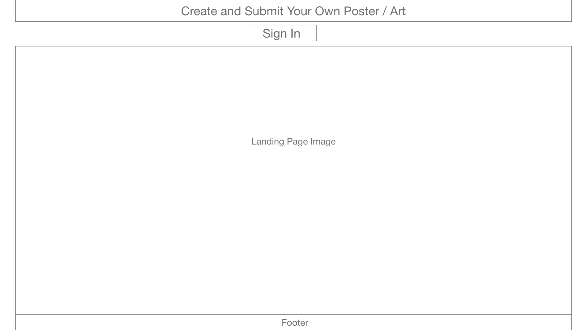
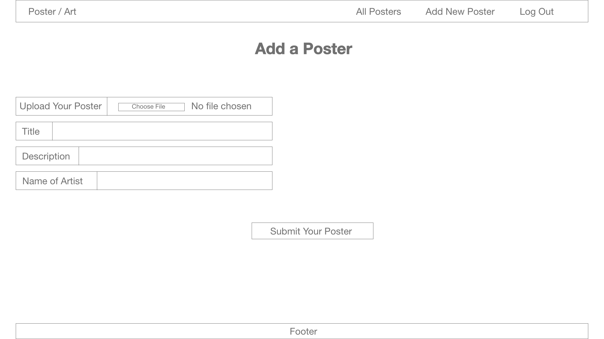

# Posters / Arts App


## Technologies Used

* [MongoDB](https://www.mongodb.com/)
* [Mongoose](https://mongoosejs.com/)
* [NodeJs](https://nodejs.org/en/)
* [ExpressJS](https://expressjs.com/)
* [EJS](https://ejs.co/)
* [CSS3](https://www.w3schools.com/css/)
* [Bootstrap](https://getbootstrap.com/)
* [OAuth2.0](https://oauth.net/2/)
* [unsplash](https://unsplash.com/)

## Installation
1. Clone the project (https://github.com/safatalnur/posterApp)
2. In the root directory, ```npm install``` to install dependencies
3. ```nodemon``` to start the server
4. Go to ```localhost:3000``` in a browser
5. Here is the heroku link.


## Planning Stage
* [Trello Board](https://trello.com/b/K5kjmHeS)
* Entity Relationship Diagram (ERD)
* Wire Frame Design
* Landing Page

* All Posters page

* Add New Poster page

* Individual Poster page


## Features
* Sign-up as a new user in the Landing Page
* View all the posters/arts in "All Posters"
* Click on "Detail" to go to individual posters/arts
* Ability to edit or delete as a user from All posters and individual posters page
* Review on the posters/arts are available in the single posters/arts page
* Click on "Add New Book" to create your own poster/art.

## ???????

## Screenshots
* All Posters Screen shot:

* Add New Poster Screen Shot:

* Single poster Review screen shot:


## Environment
* macOS catalina 10.15.5
* vsCode 1.46.1


## Author
* Safat Alnur(https://github.com/safatalnur) 

## License
(MIT)

## Acknowledgments
[@GeneralAssembly](https://generalassemb.ly/)

