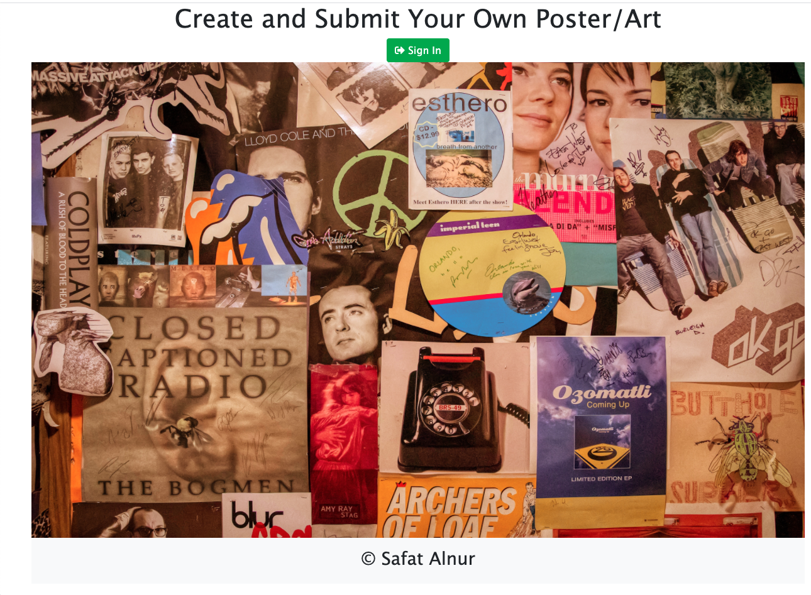
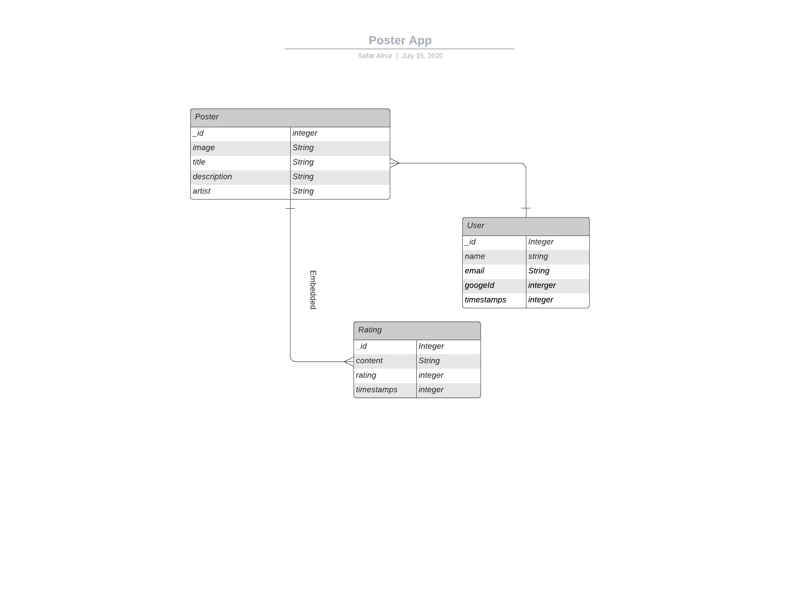
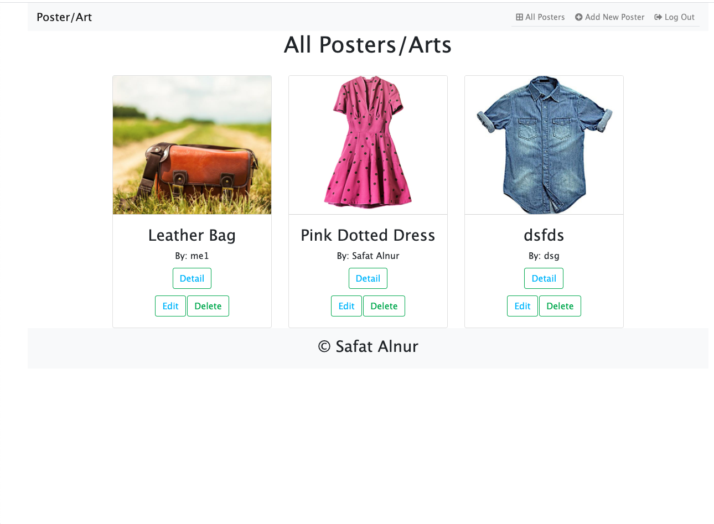

# Posters / Arts App


## Technologies Used

* [MongoDB](https://www.mongodb.com/)
* [Mongoose](https://mongoosejs.com/)
* [NodeJs](https://nodejs.org/en/)
* [ExpressJS](https://expressjs.com/)
* [EJS](https://ejs.co/)
* [CSS3](https://www.w3schools.com/css/)
* [Bootstrap](https://getbootstrap.com/)
* [OAuth2.0](https://oauth.net/2/)
* [unsplash](https://unsplash.com/)

## Installation
1. Clone the project (https://github.com/safatalnur/posterApp)
2. In the root directory, ```npm install``` to install dependencies
3. ```nodemon``` to start the server
4. Go to ```localhost:3000/home``` in a browser
5. Here is the heroku link.


## Planning Stage
* [Trello Board](https://trello.com/b/K5kjmHeS)
* Entity Relationship Diagram (ERD)

* Wire Frame Design
* Landing Page

* All Posters page

* Add New Poster page

* Individual Poster page


## Features
* Sign-up as a new user in the Landing Page
* View all the posters/arts in "All Posters"
* Click on "Detail" to go to individual posters/arts
* Ability to edit or delete as a user from All posters and individual posters page
* Review on the posters/arts are available in the single posters/arts page
* Click on "Add New Book" to create your own poster/art.

## Model View Controller (MVC)

* In Model, create a new schema:

```javascript
const mongoose = require('mongoose')

const Schema = mongoose.Schema

const ratingSchema = new Schema({
    content: {type: String},
    rating: {type: Number, min: 1, max: 5, default: 1}
}, {
    timestamps: true
})

const posterSchema = new Schema({
    image: {type: String, required: true},
    title: {type: String, required: true},
    description: {type: String, required: true},
    artist: {type: String, required: true},
    ratings: [ratingSchema]
}, {
    timestamps: true
})

module.exports = mongoose.model('Poster', posterSchema)
```
* In controller, it accepts input and converts it to commands for the model

```javascript
const Poster = require('../models/poster')
var path = require('path');
const { nextTick } = require('process');


module.exports = {
    index,
    new: newPoster,
    create,
    show,
    edit,
    update,
    deletePoster,
}

function newPoster(req, res) {
    res.render('posters/new', {title: 'Add Posters / Arts'})
}

function index(req,res) {
    Poster.find({}, function(err, posters) {
        res.render('posters/index', {
             title: 'All Posters/Arts',
             posters})
    })
}

function show(req,res) {
    const file = req.file
    console.log('File>>>>>>>', file)
    Poster.findById(req.params.id, function(err, poster) {
        
        res.render('posters/show', { title: 'Poster/Art Details', poster})
    })
}
.......
......
```

* In View, it presents the model in a particular format

```javascript
<%- include('../partials/header') %>
<div class="all-poster-container">
  <div class="row">
    <% posters.forEach(function(p) { %>
        <div class="col-sm-12 col-md-3 col-lg-4">
          <div class="card mt-4" style="width: 18rem;">
            <div class="card-detail">
              " class="card-img-top image-all-poster" alt="Posters/Arts">
            </div>
            <div class="card-body">
              <h3 class="card-title"><%= p.title %></h3>
              <h6 class="card-title">By: <%= p.artist %></h4>
                <button type="button" class="btn btn-outline-success text-success"><a href="/posters/<%= p._id %>"> Detail</a></button>
                <div class="edit-delete-buttons">
                    <button type="button" class="btn btn-outline-success edit-button"><a href="/posters/edit/<%= p._id %>" method="GET">Edit</a></button>
                    <form action="/posters/<%= p.id%>?_method=DELETE" method="POST">
                      <button type="submit" class="btn btn-outline-success">Delete</a></button>
                    </form>
                </div>
            </div>
          </div>
        </div>
      <% }) %>   
  </div>
</div>  
<%- include('../partials/footer') %>
```

## Screenshots
* All Posters Screen shot:

* Add New Poster Screen Shot:

* Single poster Review screen shot:


## Environment
* macOS catalina 10.15.5
* vsCode 1.46.1


## Author
* Safat Alnur(https://github.com/safatalnur) 

## License
(MIT)

## Acknowledgments
[@GeneralAssembly](https://generalassemb.ly/)

